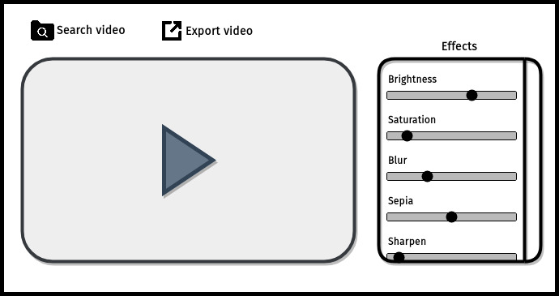

# ML Full-Stack challenge
Your objective is to build an application that lets users apply different filters in a video. The
user should be able to select a video from the computer files, and with the video loaded,
change the filter values and reproduce the video to preview the changes. The filters are up to
you, it could be changing the brightness, saturation, hue, and more - feel free to choose and
be creative. Once satisfied with the changes, the user can export the video to a new file.
So, the application must be able to:
1. Load a video from your computer
2. Choose and apply filters in the video
3. Preview the changes made on video
4. Save the video with the filter applied

Here is a simple example of what the application could look like, but again, feel comfortable
making any changes and use all of your creativity.

You can develop in any programming language, Python is more preferable.
How should you write your code?
- We prefer working on a fresh git repository
- Create objects and functions when possible
- Add comments to your code so we can better assess your thought process
Your solution will be evaluated according to efficiency, functionality, and code readability.

### Requirements
- Docker;
- docker-compose;
- make.

### Install
    make build
    make up
Go to http://0.0.0.0:8000

### Test
    make test

### Details on the implementation:
The standard instal of OpenCV through pip does not include support for writing video files encoded using formats other than mp4v. 
This format is not compatible with all web browsers, so as a work-around, I read the video file using OpenCV and process each frame as needed. 
Then save the processed frames to a temporary directory, and use the ffmpeg command-line utility to rebuild the video file from the images.

### Todo:
- sepia filter;
- hue filter;
- sharpen filter;
- improving assertions in tests.
